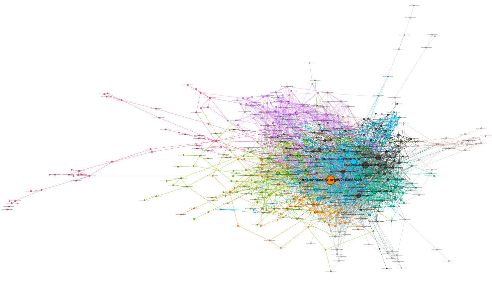

#  Horizon: Quantifying Epistemic Readiness in Scientific Citation Networks

<p align="center">
  
  <br>
  <em><strong>Figure 1:</strong> The Tectonic Plates of AI Research (2012–2017). Colors represent distinct sub-disciplines identified via Louvain Community Detection. Node size represents citation impact.</em>
</p>

##  Research Question

> **Can structural properties of scientific citation networks explain where breakthroughs emerge better than activity-based explanations?**

Instead of asking *"What will be discovered?"*, Horizon asks: **"How structurally prepared is the knowledge landscape for a discovery?"**

By modeling scientific citation networks as dynamic topological maps, Horizon attempts to identify "Structural Holes"—regions where distinct sub-disciplines are highly active but artificially isolated. The core hypothesis is that when the "Epistemic Readiness" (the pressure to bridge these gaps) reaches a critical threshold, the landscape is primed for a paradigm-shifting breakthrough.

---

##  Pilot Study Findings (Phase 0.5)

To validate the methodology, Horizon ingested the **1,000 most-cited Deep Learning papers (2012–2017)** via the OpenAlex API and mapped the citation topology.

### 1. Topological Mapping
Using the **Louvain Community Detection Algorithm**, the network spontaneously fractured into 12 distinct "tectonic plates" based purely on lateral citation behavior, including:
*   **Plate A (Community 7):** Sequence Modeling, NLP, and Relational Learning (e.g., Word2Vec, LSTMs, Bahdanau Attention).
*   **Plate B (Community 9):** Algorithmic Control, Reinforcement Learning, and Scientific ML (e.g., AlphaGo, PyTorch, Quantum Chemistry).
*   **Plate C:** Core Computer Vision and Generative Models (e.g., ResNet, GANs, YOLO).

### 2. Measuring Epistemic Readiness (The Null Model)
To determine if the gap between NLP (Plate A) and RL/Scientific ML (Plate B) was a true structural barrier or just random noise, Horizon generated **100 randomized universes** of the citation graph using a **Degree-Preserving Configuration Model**.

*   **Expected Cross-Edges (Null Mean):** 113.62
*   **Actual Cross-Edges:** 68
*   **Structural Hole Z-Score:** `-5.81` (p < 0.00001)

---

##  Interpretation & Limitations

The observed structural hole suggests that substantial topological separation existed between the NLP/Sequence Modeling and RL/Scientific ML domains during the 2012–2017 observation window. 

Whether such topological separation actively *predicts* future cross-domain breakthroughs (such as AlphaFold 2 or Decision Transformers) remains an open question. Phase 2 will rigorously test if regions with high Epistemic Readiness (deep structural holes) yield a statistically higher rate of paradigm-shifting papers compared to baseline activity metrics (H₁).

*(Methodology Note: This pilot utilized 100 randomized universes for the null model. Phase 2 will scale this to 1,000+ iterations to ensure robust p-values for publication standards.)*

---

##  Project Roadmap

- [x] **Phase 0.5: Pilot Study & Reality Audit** 
  - Validated OpenAlex API data density and lateral citation topology.
  - Proved Louvain clustering successfully isolates semantic sub-disciplines.
  - Validated the Null Model Z-Score math against Super-Hub noise.
- [ ] **Phase 1: Temporal Community Tracking (1990-2015)**
  - Implement Jaccard Similarity to track how communities merge, split, and evolve year-over-year.
- [ ] **Phase 2: Historical Backtesting & AUC Evaluation**
  - Test H₀ (Stochastic), H₁ (Activity/Rich-get-richer), and H₂ (Epistemic Readiness) against actual historical breakthroughs.
- [ ] **Phase 3: Interactive Web Dashboard**
  - Deploy a Streamlit application allowing users to scrub through time and watch Epistemic Pressure build in real-time.

---

## 📂 Repository Structure

```text
Horizon-Epistemic-Readiness/
│
├── data/
│   └── processed/           # Cleaned CSVs (openalex_nodes.csv, openalex_edges.csv)
│
├── src/                     # Core pipeline scripts
│   ├── openalex_cluster.py  # API ingestion, graph building, Louvain clustering, CSV export
│   ├── measure_pressure.py  # Null model & Z-score calculation (Epistemic Readiness)
│   ├── inspect_plates.py    # Community inspection & semantic sampling
│   └── export_for_gephi.py  # GEXF export for topological visualization
│
├── outputs/             
│   └── gephi/               # .gexf network files and exported topology screenshots
│
├── config.py                # LOCAL ONLY: Stores OpenAlex API email (Ignored by Git)
├── requirements.txt         
├── .gitignore
└── README.md
```

---

##  Step-by-Step Setup & Execution Guide

### Step 1: Environment Setup
```bash
# Clone the repository
git clone https://github.com/shreyashhu/Horizon-Epistemic-Readiness.git
cd Horizon-Epistemic-Readiness

# Create and activate a virtual environment
python -m venv venv
source venv/bin/activate  # On Windows: venv\Scripts\activate

# Install dependencies
pip install -r requirements.txt
```

### Step 2: Configure API Credentials
OpenAlex provides a significantly faster "polite pool" API rate limit if you include your email. To protect your privacy, we use a local config file that is ignored by Git.

1. Create a file named `config.py` in the root directory.
2. Add your email:
   ```python
   # config.py
   EMAIL = "your_actual_email@example.com"
   ```
3. Verify that `config.py` is listed in `.gitignore`.

### Step 3: Run the Pipeline (In Order)
Run these scripts sequentially from the root directory. Each script builds on the outputs of the previous one.

```bash
# 1. Fetch data, build the graph, run Louvain clustering, and save CSVs
python src/openalex_cluster.py

# 2. Calculate the Epistemic Readiness Z-Score between two plates
python src/measure_pressure.py

# 3. Inspect the semantic meaning of specific communities
python src/inspect_plates.py

# 4. Export the network for visualization
python src/export_for_gephi.py
```
*Outputs will be saved to `data/processed/` and `outputs/gephi/`.*

---

##  Step 4: Visualize the Topology in Gephi

Gephi is a free, open-source network visualization tool. Follow these exact steps to generate the "Tectonic Plates" map.

### 1. Install & Open
*   Download Gephi from [gephi.org](https://gephi.org/) and install it.
*   Open Gephi. Go to `File → Open` and select `outputs/gephi/horizon_openalex_map.gexf`.
*   Click `OK` on the import report.

### 2. Run the Layout (ForceAtlas 2)
*   Look at the **Layout** panel (bottom-left).
*   Select `ForceAtlas 2` from the dropdown.
*   **Crucial Settings:**
    *   ✅ Check `Prevent Overlap`
    *   Change `Scaling` from `1.0` to `10.0` (gives clusters room to breathe)
*   Click `Run`. Watch the graph explode into distinct clusters. Wait ~10–15 seconds until movement stabilizes, then click `Stop`.

### 3. Color by Community (Partition)
*   Look at the **Appearance** panel (top-left). Ensure the `Nodes` tab is selected.
*   Click the **Palette icon** (Colors) → `Partition` tab (pie chart icon).
*   In the dropdown, select `community`.
*   Click `Apply`. Your tectonic plates will instantly light up in distinct colors.

### 4. Size by Impact (Ranking)
*   Still in **Appearance** → `Nodes`, click the **Diamond icon** (Size) → `Ranking` tab (bar chart icon).
*   Select `Degree` from the dropdown.
*   Set `Min size` to `10` and `Max size` to `60`.
*   Click `Apply`. Foundational papers (hubs) will now appear larger.

### 5. Enable Labels & Export
*   Look at the toolbar at the **bottom center** of the graph window.
*   Click the black **`T`** icon to show labels.
*   Click the small white **`T`** next to it to scale label size proportionally to nodes.
*   Go to the `Preview` tab (top menu). Click `Refresh`.
*   Click the **Camera icon** (bottom-right) to export a high-resolution PNG. Save it as `outputs/gephi/horizon_map.png`.

---

##  Data Sources & Acknowledgments

*   **OpenAlex:** Horizon relies entirely on the [OpenAlex](https://openalex.org/) index, which provides a fully open, comprehensive, and un-embargoed catalog of the global research system.
*   **NetworkX & Python-Louvain:** For graph construction and modularity-based community detection.
*   **Gephi:** For high-resolution topological rendering and ForceAtlas2 layout generation.

---

## 📜 License
This project is built for academic research and computational scientometrics exploration.