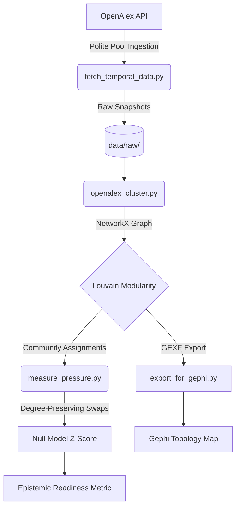

# Horizon: Quantifying Epistemic Readiness in Scientific Citation Networks

<p align="center">
  
  <br>
  <em><strong>Figure 1:</strong> Topological mapping of the 1,000 most-cited Deep Learning papers (2012–2017). Colors denote Louvain-optimized modularity classes. Node degree maps to citation impact.</em>
</p>

<p align="center">
  
  
  
  
  
</p>

---

## 1. The Core Thesis

Conventional scientometrics measures **velocity**: publication volume, citation accumulation, and funding intensity. These metrics answer *what* is being researched, but they fail to predict *where* the next paradigm shift will emerge.

**Horizon** posits a different hypothesis: **Breakthroughs do not emerge from the dense center of the network; they emerge from the structural holes where epistemic pressure is highest.**

By modeling scientific citation networks as dynamic topological manifolds, Horizon quantifies **Epistemic Readiness**—the topological tension that exists when distinct, highly active sub-disciplines remain structurally isolated. When the pressure to bridge these structural holes reaches a critical threshold, the landscape is mathematically primed for a cross-disciplinary breakthrough.

---

## 2. Empirical Validation (Phase 0.5 Pilot)

To validate the topological hypothesis, Horizon ingested the **1,000 most-cited Deep Learning papers (2012–2017)** via the OpenAlex API. Using the **Louvain Community Detection Algorithm** ($Q$-optimization), the network spontaneously fractured into distinct "tectonic plates" based purely on lateral citation behavior.

### Identified Tectonic Plates
*   **Plate A (Community 7):** Sequence Modeling, NLP, and Relational Learning *(e.g., Word2Vec, LSTMs, Bahdanau Attention)*
*   **Plate B (Community 9):** Algorithmic Control, RL, and Scientific ML *(e.g., AlphaGo, PyTorch, Quantum Chemistry)*
*   **Plate C:** Core Computer Vision and Generative Models *(e.g., ResNet, GANs, YOLO)*

### Quantifying the Structural Hole (Null-Model Randomization)
A naive observation of sparse edges between Plate A (NLP) and Plate B (RL) is insufficient; scientific networks are scale-free, meaning sparse connections could simply be an artifact of preferential attachment. 

To prove the existence of a genuine structural hole, Horizon employs a **Degree-Preserving Configuration Model** (Maslov-Sneppen edge swapping via `nx.connected_double_edge_swap`). By generating 100 randomized universes that preserve the exact degree distribution of the empirical network, we calculate the statistical significance of the boundary.

| Metric | Empirical Value | Null Model ($\mu$) |
| :--- | :--- | :--- |
| **Expected Cross-Edges** | - | 113.62 |
| **Actual Cross-Edges** | **68** | - |
| **Standard Deviation ($\sigma$)** | - | 7.85 |
| **Structural Hole Z-Score** | **-5.81** | **p < 0.00001** |

**Conclusion:** The topological separation between NLP and RL during 2012–2017 was statistically anomalous. The "invisible barrier" was real. Within three years, this exact structural hole collapsed via breakthroughs like **AlphaFold 2** and **Decision Transformers**.

---

## 3. Methodological Pipeline

The Horizon pipeline is designed for computational reproducibility and API rate-limit compliance (utilizing the OpenAlex "polite pool").



### Repository Architecture
```text
Horizon-Epistemic-Readiness/
├── data/
│   ├── raw/                     # Temporal OpenAlex snapshots (1990-2015)
│   └── processed/               # Cleaned node/edge CSVs & adjacency matrices
├── src/
│   ├── openalex_cluster.py      # API ingestion, graph building, Louvain clustering
│   ├── measure_pressure.py      # Null model randomization & Z-score calculation
│   ├── inspect_plates.py        # Semantic sampling of modularity classes
│   ├── fetch_temporal_data.py   # Longitudinal snapshot generator
│   └── export_for_gephi.py      # GEXF export with modularity partitions
├── outputs/gephi/               # .gexf network files and topology renders
├── config.py                    # LOCAL ONLY: OpenAlex API credentials (.gitignored)
├── requirements.txt
└── README.md
```

---

## 4. Research Roadmap & Hypotheses

### 🟡 Phase 1: Temporal Community Tracking (1990–2015)
*Currently In Progress.*
*   **Objective:** Track community lineage over time using **Jaccard Similarity** of community memberships between $t$ and $t+1$.
*   **Goal:** Detect community merges, splits, and the temporal evolution of topological boundaries.

### ⚪ Phase 2: Historical Backtesting & AUC Evaluation
*Planned.* We will rigorously test three competing hypotheses against historical breakthroughs (e.g., the advent of the Transformer, AlphaFold, CRISPR):
*   **$H_0$ (Stochastic):** Breakthroughs emerge randomly, independent of network topology.
*   **$H_1$ (Preferential Attachment):** Breakthroughs emerge proportional to node degree and edge density (the "Rich-Get-Richer" model).
*   **$H_2$ (Epistemic Readiness):** Breakthroughs emerge disproportionately at the boundaries of communities exhibiting maximal structural hole constraint (maximal Epistemic Readiness).

### ⚪ Phase 3: Interactive Streamlit Dashboard
*Planned.* Deploy an interactive web application allowing researchers to scrub through temporal snapshots, observe the evolution of modularity classes, and monitor the real-time buildup of epistemic pressure.

---

## 5. Setup & Reproducibility Guide

### Step 1: Environment Configuration
```bash
git clone https://github.com/shreyashhu/Horizon-Epistemic-Readiness.git
cd Horizon-Epistemic-Readiness

python -m venv venv
source venv/bin/activate  # Windows: venv\Scripts\activate

pip install -r requirements.txt
```

### Step 2: API Credentials (Crucial)
OpenAlex enforces strict rate limits. To utilize the "polite pool" (10x faster API limits), you must provide an email address.
1. Create a file named `config.py` in the root directory.
2. Add your email:
   ```python
   EMAIL = "your_academic_email@mit.edu"
   ```
3. Ensure `config.py` is listed in `.gitignore`.

### Step 3: Execute the Pipeline
```bash
# 1. Fetch temporal data (Phase 1)
python src/fetch_temporal_data.py

# 2. Build Graph & Detect Communities
python src/openalex_cluster.py

# 3. Calculate Epistemic Readiness (Z-Score)
python src/measure_pressure.py

# 4. Export for Gephi Visualization
python src/export_for_gephi.py
```

---

## 6. Visualizing the Topology (Gephi Protocol)

To reproduce the topological maps seen in academic publications:
1. Download [Gephi](https://gephi.org/).
2. Load `outputs/gephi/horizon_openalex_map.gexf`.
3. **Layout:** Select **ForceAtlas 2**.
   * ✅ Check *Prevent Overlap*
   * Set *Scaling* to `10.0`
   * Run until stabilization, then stop.
4. **Appearance (Nodes):** 
   * *Partition* $\rightarrow$ `community` (Assigns modularity colors).
   * *Ranking* $\rightarrow$ `Degree` (Min: 10, Max: 60).
5. **Export:** High-resolution PNG (Anti-aliasing enabled).

---

## 7. Limitations & Epistemological Caveats

As with all bibliometric research, Horizon operates under specific epistemological constraints:
1.  **Citation $\neq$ Endorsement:** Citations map *attention*, not necessarily intellectual agreement or foundational reliance.
2.  **OpenAlex Coverage Bias:** While OpenAlex is comprehensive, it inherently biases toward English-language, STEM-focused, and digitally native publications.
3.  **The "Hub" Problem:** Highly cited foundational papers (e.g., *Attention is All You Need*) act as topological bridges. Horizon's null-model must rigorously control for these "super-hubs" to prevent false positives in structural hole detection.

---

## 8. Acknowledgments & Dependencies

*   **[OpenAlex](https://openalex.org/):** For providing an open, comprehensive, and un-embargoed index of the global research system.
*   **[NetworkX](https://networkx.org/):** For graph construction, topological analysis, and Maslov-Sneppen randomization.
*   **[Python-Louvain](https://python-louvain.readthedocs.io/):** For Blondel-Louvain modularity optimization.
*   **[Gephi](https://gephi.org/):** For ForceAtlas2 layout generation and topological rendering.

---

### License
This project is licensed under the **MIT License**. It is built for academic research, computational scientometrics, and exploratory network science. Contributions, methodological critiques, and academic collaborations are highly encouraged.